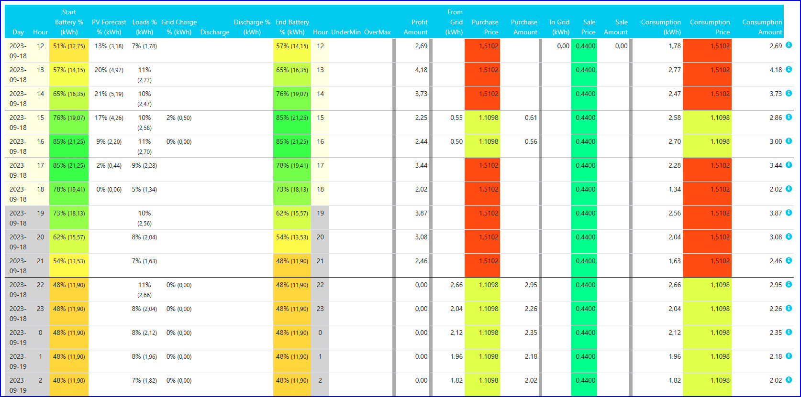
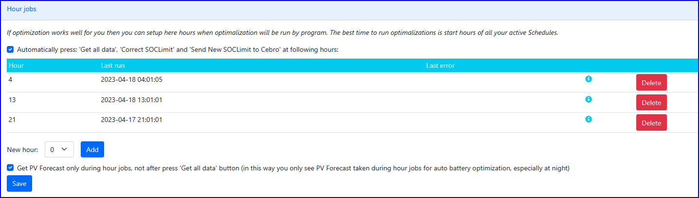

### Prognoza Baterii

W tym module możesz:
- analizować SOC baterii na następne 24h liczone w oparciu o ładowanie z
PV, ładowanie z sieci, rozładowanie i zużycie przez dom.
- zobaczyć kiedy SOC przekracza minimalne a kiedy maksumalne wartości.
- optymalizować Ładowanie i Plany Rozładowania aby mieć pełną baterię,
ale nie zejść poniżej minimum ani przekroczyc maksimum (to może być
powiązane z przesuwaniem momentu Ładowania do najwyższych cen oraz
Rozładowania do najniższych cen)
- zobaczyc ceny zakupu i sprzedaży oraz zystki na najbliższe 24h

### Kolumny

W tablicy widać dane na nabliższe 24h
(DC = prąd stały, AC = prąd zmienny)

Bateria:
- "Dzień" - dzień
- "Godzina" - godzina w danym dniu
- "Pocz bateria % (kWh) AC/DC" - SOC i kWh baterii na początku danej godziny (po przekonwertowaniu na AC i w DC)
- "Prognoza PV (kWh AC)" - prognoza produkcji PV w tej godzinie
- "Prognoza PV % (kWh DC)" - ile kWh zostanie przekazane
do bateria (po przekonwertowaniu na DC) z PV minus Zużycie
przez dom
- "Zużycie +Extra (kWh AC)" - prognoza Zużycia przez dom w tej godzinie (wliczając Extra Zużycie)
- "Zużycie +Extra % (kWh DC)" - ile kWh zostanie pobrane z baterii aby zasilić Zużycie minus PV
- "Ładowanie z sieci (kWh AC)" - ile zostanie pobrane z sieci aby naładować baterie (przez Ładowanie) w tej godzinie
- "Ładowanie z sieci % (kWh DC)" - ile zostanie pobrane z sieci aby
naładować baterie (przez Ładowanie) w tej godzinie (po
przekonwertowaniu na DC)
- "Rozładowanie" - status Planu Rozładowywania na tą godzinę
- "Rozładowanie (kWh AC)" - ile zostanie wysłane z baetrii do sieci w tej godzinie (po przekonwertowaniu na AC)
- "Rozładowanie % (kWh DC)" - ile zostanie wysłane z baetrii do sieci w tej godzinie
- "Koniec baterii (kWh AC)" - kWh w baterii na koniec tej godziny. **End Battery AC =** Start Battery AC + PVInv AC - Loads AC + Grid Charga AC - Discharge AC
- "Koniec baterii % (kWh DC)" - SOC i kWh w baterii na koniec tej godziny. **End Battery DC =** Start Battery DC + PVInv DC - Loads DC + Grid Charga DC - Discharge DC
- "Poniżej Min" - "Tak" oznacza: Koniec Baterii może zejść poniżej 'Minimalny SOC baterii (%)" zdafiniowany w Instalacji
- "Powyżej Max" - "Tak" oznacza: Koniec Baterii może przkroczyć 'Maksymalny SOC baterii (%)" zdefiniowany w Instalacji

Zysk:
- "Kwota zysku" - Zysk z Instalacji w tej godzinie. **Zysk =** Kwota zużycia - (Kwota zakupu - Zmiana wartości baterii (PLN)) + Kwota sprzedaży - Kwota kosztu baterii
- "Nie zapłacona kwota za energię" **=**Kwota sprzedaży - (Kwota zakupu - Zmiana wartości baterii (PLN))  - Kwota kosztu baterii
- "Kwota kosztu baterii" = 'Koszt używania baterii za kWh' ustalony
w Instalacji (money/kWh) \* 'Ładowanie
baterii' (kWh): Amortyzacja baterii
- "Z sieci (kWh)" - ile zostanie pobrane z sieci w tej godzinie
- "Cena zakupu" - cena zakupu energii w tej godzinie
- "Kwota zakupu" - 'Z sieci' \* 'Cena zakupu': Wartość kupionej energii
- "Do sieci (kWh)" - ile zostanie wysłane do sieci w tej godzinie
- "Cena sprzedaży" - cena sprzedaży energii w tej godzinie
- "Kwota sprzedaży" = 'Do sieci' \* 'Cena sprzedaży': Wartość sprzedanej energii
- "Zużycie (kWh)" - ile dom Zużyje
- "Cena zużycia" - cena energii zużytej przez dom w tej godzinie
- "Kwota zużycia" = 'Zużycie' \* 'Cena zużycia': Wartość energii zużytej przez dom

Wartość energii w baterii
- "Ładowanie baterii (kWh)" - >0 ładowanie, <0-rozładowanie
baterii - Ile energii zostało pobrane z lub wysłane do baterii
- "Ładowanie z sieci (kWh)" - ile energi wysłane do baterii pochodzi z sieci
- "Rozładowanie (kWh)" - ile energii zostało pobranych z baterii
- "Pocz. kWh w baterii" - ile energii będzie w baterii na początku godziny (ponad MinSOC%)
- "Wartość pocz. (PLN)" - wartość energii w baterii na początku godziny
- "Końcowe kWh w baterii" - ile energii będzie w baterii na końcu godziny (ponad MinSOC%)
- "Wartość końcowa (PLN)" - wartość energii w baterii na końcu godziny
- "Zmiana wartości (PLN)" = "Wartość końcowa" - "Wartośc
początkowa"; dla rozładowywania: "Rozładowanie (kWh)" \* "Średnia
początkowa cena (PLN)" (czyli "Średnia końcowa cena" wzięta z
poprzedniej godziny); dla ładowania: "Ładowanie z sieci (kWh)" \* "Cena
zakupu"
- "Średnia końcowa cena (PLN)" - Średnia cena energii na koniec godziny: "Wartośc końcowa (PLN)" / "Końcowe kWh w baterii"

### Optymalizator

Po kliknięciu 'Uruchom Optymalizator teraz' program może zmienić
- SOCLimit w Ładowaniu (i nawet zablokowac Ładowanie),
- MinSOC w Planie Rozładowywania i
- zablokowac disable Dynamiczne Blokowanie Rozładowania Baterii (DDBD)
w zależności od strategii optymalizacji.

Są dwa Optymalizatory:
(1) "**Ładowanie/Rozładowywanie jest optymalizowane na podstawie SOC (z dodatkowymi optymalizatorami)**" - optymalizator zmienia Ładowania i aktualny Plan Rozładowywania.

Ten optymalizator próbuje:
- dojść do 100% (lub MaxSCO ustawione w Instalacji) w którymś momencie (ale nie za długo)
- utrzymać baterie powyżej 10% (lub MinSCO ustawione w Instalacji) - co jest ważniejsze
- wykorzystuje ustawione momenty ładowania i rozładowania (nalezy to wcześniej ręcznie ustawić)

Uwagi:
- optymalizator może być połączony z 'Dynamiczne
Ładowaniem' (ładuj, gdy cena jest najniższa) i 'Dynamicznym
Rozładowaniem' (rozładu, gdy cena jest najwyższa).
- optymalizator może ładować baterie w nocy (podczas taryfy z niskimi
cenami) w ten sposób, aby zostało miejsce w bateriach na planowaną
energię z PV podczas dnia.
- optymalizacor może rozładowywać baterie przy wysokich cenach w ten
sposób, aby podczas dnia planowana produkcja z PV spowodowała
naładowanie baterii do MaxSCO.
- jezeli cena zakupu <0 Ładowanie w tych godzinach jest ustawiane ma MaxSOC

(2) "**Ładowanie/Rozładowywanie jest optymalizowane na podstawie cen zakupu i sprzedaży (aby zwiększyć Zysk)**" (sugerowany)

Ten Optymalizator próbuje maksymalizować zysk w oparciu o ceny zakupu i ceny sprzedaży.
Próbuje znaleźć najlepsze ładowanie/rozładowanie w każdej godzinie aby znaleźć najlepszą sumę w kolumnie 'Kwota zysku'.

Po wykonaniu optymalizacji nowe ustawienia Ładowania i Planu
Rozładowania nie są wysyłane do Instalacji. Powinieneś przejrzeć
Ładowania i Plant Rozładowywania aby sprawdzić, czy wszystko jest OK i
wtedy nacisnąć przycisk 'Wyślij nowe SOCLimit z Ładowania do Instalacji"

Uwagi:
- Optymalizator powinien być uruchamiany co godzinę
- Optymlizator wymaga, aby import w module Zysk był uruchamiany co godzinę !
- obserwacja: Ładowanie, kiedy ładowana energie nie jest nigdy
zużywana (poniewać prognoza działą tylko na najbliższe 24h), jest
bezkosztowa. Więc na końcu 24h okresu ładowania zdarzają się bardzo
często. Poczekaj kilka godzin, aby zobaczyć lepsza prognozę.
- Każda włączona dodatkowa opcja obniża twoje zyski!

### Parametry optymalizatora opartego o ceny

|  |  |
| --- | --- |
| **SOC** |  |
| Wolę mieć więcej w baterii niż mniej: | Są sytuacje, w których różne ładowania daje taki sam zysk: Oto kilka strategii:  Poziom 0 – Wolę nie ładować niż łądować  Poziom 1 – Wolę ładować więcej niż mniej  Poziom 2 – Wolę łądować więcej niż mniej + Wolę ładować niż nie ładować (dla taryfy G12w) |
| Maksymalny SOC baterii (%) | Optymalizator próbuje nie przekraczać tej wartości |
| Minimalny SOC baterii (%) | Optymalizator próbuje nie schodzić poniżej tej wartości |
| Zwiększ Minimalny/Maxymalny SOC baterii o X jeżeli Prognoza PV mniejsza niż Y | Zwiększ rezerwę w bateriach, jeżeli ma być mało słońca |
| Wymuszaj codziennie MaxSCO (100%) - aby być UPSem | Powoduje, że raz dziennie przez 2-3h baterie są ładowane do 100% |
| ... spróbuj tylko podczas optymalizacji od północy do wschodu słońca (w nocy) | Wymuszanie jest obliczane tylko w nocy, dzięki temu, gdy prognoza pogody ulegnie zmianie (zmniejszy się) program nie stara na siłę dobić do 100% w ciągu dnia. |
| ... zamień zachód słońca na stałą godzinę | Umożliwia zastąpienie godziny zachodu np: godziną końca taniej taryfy |
| **Balansowanie baterii** |  |
| Minimalny SOC, aby uznać to za Balansowania baterii | Poziom SOC od które program uznaje, że jest to balansowanie. Jeżeli podczas balansowania SOC spada nieznacznie, należy wpisac tutaj niższa wartość |
| i musi trwać co najmniej (godzin) | Czas trwania balansowania |
| Lista dni w miesiącu (oddzielona przecinkiem) kiedy Optymalizator ma trzymać 3hx100% (balansowanie) | Wymuszaj balansowanie w te dni miesiąca |
| Ile dni wstecz sprawdzać, czy były już wcześniej 3hx100%, aby niepotrzebnie nie ładować baterii: | Blokada za częstego balansowania |
| Po ilu dniach ponownie trzymać 3hx100% od poprzedniego 3x100%?: | Alternatywny sposób wymuszania balansowanie: po x dniach od poprzedniego |
| Ręcznie wymuś 3hx100% dzisiaj | Ręczne wymuszenie balansowania dzisiaj. Po balansowanie opcja zostanie wyłaczona |
| 3hx100% jeżeli cena zakupu jest niższa niż ... przez co najmniej godzin... | Wymuszaj balansowanie, jak cena jest niska (uzywane włacznie z "Ile dni wstecz sprawdzać, czy były już wcześniej 3hx100%") |
| **Ładowanie, rozładowanie** |  |
| Ładowanie baterii z sieci | Pozwala wyłączyć ładowanie baterii z sieci |
| Rozładowywanie baterii do sieci | Pozwala wyłączyć rozładowanie baterii do sieci (lub zostawić ustawienia zdefiniowane w Planie Rozładowania) |
| Rozładowanie do sieci: minimalna różnica cen (między ceną energii w bateriach a cena sprzedaży) | Ustala minimalną różnicę cen, przy której dozwolone jest rozładowywanie baterii do sieci. Ustawienie 0 powoduje, że program nie rozładowuje do sieci ze stratą (co czasami umożliwia opróżnienie baterii, aby później więcej zarobić) |
| Nie rozładowywuj baterii do sieci, gdy cena sprzedaży jest niższa niż | Blokuje rozładowanie baterii, gdy cena sprzedaży jest niższa niż podana. |
| Nie rozładowywuj baterii do sieci, gdy cena zakupu niższa niż | Blokuje rozładowanie baterii, gdy cena zakupu jest niższa niż podana. Umożliwia to pozostawianie prądu w bateriach dla droższych taryf.  Idea: w taniej taryfie bierzemy zawsze z sieci (i do tego jest ta opcja), a do baterii ładujemy tylko z PV i wykorzystujemy tylko przy wysokiej taryfie. Na wypadek BARDZO małej produkcji PV doładowujemy w taniej taryfie do np: 60% (MaxSOC=60%) |
| Nie ładuj baterii z sieci, gdy cena zakupu jest wyższa niż | Blokuje ładowanie, gdy cena zakupu (!) jest wyższa niż podana. |
| **Import z sieci, export do sieci** |  |
| Próbuj nie importować z sieci | Optymalizator próbuje nie pobierać prądu z sieci (dostaje za to po łąpach), co nie znaczy, że nie może to się zdarzyć. Jeżeli nie chcesz ładować baterii z sieci, to w menu Ładowanie zaznacz 'Zablokowany' we wszystkich pozycjach |
| Próbuj nie eksportować do sieci | Optymalizator próbuje nie eksportować prądu do sieci (z PV ani z baterii), co nie znaczy, że nie może to sie zdarzyć. |
| Nie sprzedawaj więcej niż nie-skorygowana prognoza produkcji PV z ostatnich 24h | (Opcja dla PL): Blokuje możliwośc sprzedaży więcej prądu z baterii niż ilość wyprodukowanej energii z PV.  Dla każdej godziny z prognozy: program bierze x godzin wstecz i liczy ilość prognozy oraz ilość rozładowania (wymuszonego). Akceptuje gdy suma rozładowania <= suma prognozy. Koszt liczenia jest O(n), więc jest liniowy. |
| Próbuj nie eksportować do sieci, gdy cena sprzedaży <0 | Optymalizator próbuje nie eksportować do sieci, gdy cena sprzedaży jest ujemna. |
| **Inne parametry** |  |
| Zablokuj wejście powyżej MaxSOC (poprzez rozładowanie do MaxSOC) | Sztucznie blokuje wejście powyżej MaxSOC poprzez wymuszenie rozładowania do MaxSOC. |
| Zablokuj zejście poniżej MinSOC (poprzez ładowanie do MinSOC) | Sztucznie blokuje zejście poniżej MinSOC poprzez wymuszenie łądowania do MinSOC. |
| Nie ładuj baterii z sieci, gdy EV będzie ładowany | Gdy zostanie wprowadzone ładowanie EV, to w tym czasie optymalizator nie planuje ładowania baterii. |
| Nie rozładowywuj baterii do sieci, gdy EV będzie ładowany | Gdy zostanie wprowadzone ładowanie EV, to w tym czasie optymalizator nie planuje rozładowywanie baterii. |
| Co mn. w. 5 minut testuj ładowanie EV, aby wyłączyć ładowania/rozładowania | Program sprawdza co 5 min, czy rozpoczęło się ładowanie EV, i ew. wyłacza ładowanie/rozładowanie baterii. Dzięki temu nie trzeba wpisuwać do programu z wyprzedzeniem, że sie chce ładowac EV. |
| Próbuj prognozować więcej niż tylko 24h | Jeżeli jest zaznaczone, to optymalizator bierze pod uwage więcej niz 24h do przodu: aż do końca godzin, gdzie znane są ceny (wliczając w to ceny symulowane)  Optymalizator może wyłączyć ta opcję, jeżeli optymalizacja trwa za długo. |
| Nie cofaj się do prognozy "nic nie rób" | Program sprawdza, czy wymyślona prognoza nie jest gorsza niż "nic nie rób". Jeżeli jest, to cofa sie do "nic nie rób". Opcja ta wyłącza to sprawdzanie. |
| Licz koszt energii w momencie ładowania baterii z sieci | Normalnie koszt zakupu energii jest rozliczny w momencie, gdy ta energia jest zużywana. Powoduje to, że jak nie jest zuzywana do końca prognozy, to program kupuje maksumalną ilośc energii. Zaznaczenie tej opcji powoduje, że zakup energii jest rozliczny w momencie jej zakupu (wymyslił ją użytkownik CRQ) |
| Minimalny/Maksymalny SOC na końcu prognozy baterii | Wymuszenie poziomu SOC na końcu całej prognozy pogody |
| Koszt używania baterii za kWh | = Koszt zakupu baterii / (ilość cykli \* pojemność w kWh)  Zalecamy zostawić to pole puste. |

Kiedy optymalizator jest uruchamiany:
- dla 24 przedziałów caasowych (60min): po x:00
- dla 48 przedziałów czasowych (30min): po x:00 i x:30
- dla 96 przedziałów czasowych (15min): po x:00 i x:30

Kiedy eksport danych do inwertera jest wykonywany (po uruchomieniu optymalizatora)
- dla 24 przedziałów caasowych (60min): po x:00 (w razie błędu dwa razy)
- dla 48 przedziałów czasowych (30min): po x:00 i x:30 (w razie błędu dwa razy)
- dla 96 przedziałów czasowych (15min): po x:00, x:15, x:30, x:45

### Testowanie różnych scenariuszy

Aby przetestować różne scenariusz możesz:
- stworzyć więcej niż jeden Profil Zużycia
- stworzyć więcej niż jeden Plan Rozładowywania
- tymczasowo wyłączyć prognozę PV, aby zobaczyc najgorszy scenarius
W sekcji 'Filtry' możesz wybrać aktualny Profil Zużycia, Plan Rozładowywania i wyłączyć prognozę PV.
- w Ładowaniu ustawić 'Nowy początek', Nowy Czas Trwania' i 'Nowy SOCLimit' bez wysyłania tych danych do Instalacji.

### Zadania godzinowe

Jeżli ręcznie uruchamiana optymalizacja działa dobrze, możesz ustawić
godziny kiedy optymalizacja ma być automatycznie uruchamiana. Najlepsza
godzina optymalizacji (dla Optymalizatora opartego na SOC) sa
początkowe godziny aktywnych Ładowań, ale jeżeli używasz Planu
Rozładowania wtedy najlepiej uruchamiac co godzinę.

Aby uruchomić zadania godzinowe należy:
- zaznaczyć 'Automatycznie naciskaj: 'Pobierz wszystkie dane' i 'Uruchom Optymalizator''
- zaznaczyć '... i 'Wyślij nowe SOCLimit do Instalacji''
- dodać jedną lub więcej godzin

### Dodatkowe opcje

|  |  |
| --- | --- |
| Uruchom zadanie godzinowe także w połowie godziny (nie rekomendowane) | dla 24 przedziałów czasowych (60min): Normalnie optymalizator jest uruchamiany co godzinę. Ta opcja powoduje dodatkowe uruchamianie optymalizatora w połowie godziny |
| Wysyłaj dane to inwertera i ustawiaj Włączniki IoT wcześniej (przed uruchomieniem optymalizatora) | (nie dla 96 przedziałów czasowych (15min)): Normalnie najpierw uruchamiany jest optymalizator a potem wysyłane są nowe ustawienia do inwertera, ale czasami to jest 4-5 minute po pełnej godzinie. Ta opcja powoduje, że najpierw wysyłane są ustawienia do inwertera (obliczone godzinę wcześniej) potem uruchamiany jest optymalizator a potem wysyłane są nowe ustawienia do inwertera.  (dla 96 przedziałów czasowyc (15 min)): opcja jest zawsze włączona i najpierw są wysyłane ustawienia, potem jest uruchamiany optymalizator, ale nowe ustawienia są wysyłane w nastepnym przedziale 15 minutowym |
| Pobierz Prognozę PV tylko podczas Zadań Godzinowych, a nie po naciśnięciu przycisku 'Pobierz wszystkie dane' | Normalnie prognoza PV jest importowana bardzo często. Ale jeżeli chcesz widzieć ostatnia prognozę, która była wzięta pod uwagę podczas optymalizacji, zaznacz 'Pobierz Prognozę PV tylko podczas Zadań Godzinowych, a nie po naciśnięciu przycisku 'Pobierz wszystkie dane''. Prognoza PV będzie importowana tylko podczas zadań godzinowych albo jak naciśniesz 'Pobierz prognozę PV' w module 'Prognoza PV'. |
