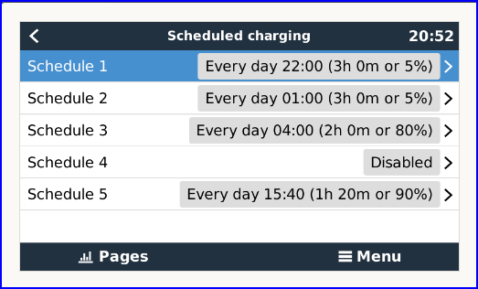
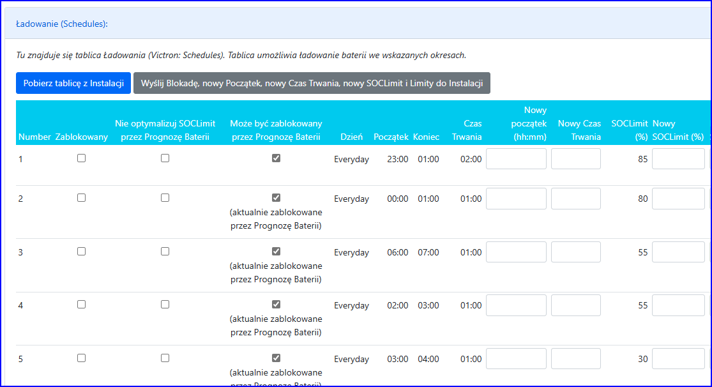
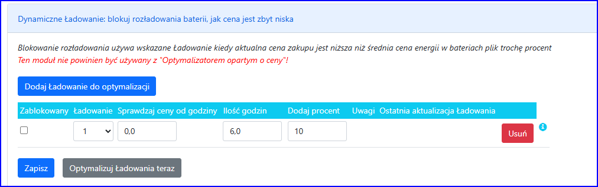
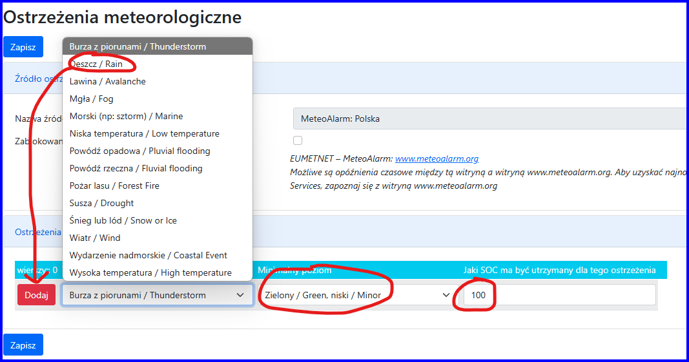

### Victron: O ładowaniu

Schedules są częścią modułu ESS w Victron/Cerbo. Służą do ładowania akumulatora w zadanym czasie do zadanego SOCLimita

**Uwagi:**
- Victron: Zakładamy, że „Self-consumption above limit” jest ustawiony
na „PV” (a nie „PV & Battery”), ponieważ chcemy, aby Harmonogram
zatrzymywał rozładowywanie akumulatora w nocy!

### Pobierz tablicę z instalacji

Victron: Program połączy się z Instalacją i pobierze 5 Schedulerów.

### Zmiany Ładowania

Możesz zmieniać Ładowanie:
- zablokować i odblokować wiersz ładowania
- zmień godzinę rozpoczęcia i czas trwania - kolumny „Nowy początek” i „Nowy czas trwania”.
- zmień limit SOC - kolumna „Nowy SOCLimit”
Po zmianie:
- możesz nacisnąć „Zapisz”, wówczas zmiany zostaną zapisane w programie,
ale nie wysłane do Instalacji. W ten sposób możesz sprawdzić różne
scenariusze w prognozie baterii.
- możesz nacisnąć 'Wyślij ... do Instalacji' wtedy zmiany zostaną zapisane w programie i wysłane do Inwertera.

Jeśli naciśniesz przycisk „Wyczyść wszystkie nowe wartości”, kolumny
„Nowy początek”, „Nowy czas trwania” i „Nowy SOCLimit” zostaną
wyczyszczone.

### Parametry ładowania

|  |  |  |
| --- | --- | --- |
| Staraj się rozciągnąć ładowanie do pełnej godziny | Wszyskie | Zmniejsza moc ładowania, aby trwało ono całą godzinę. Uzywa się tej opcji razem z następną! |
| Specjalne liczenie szybkości ładowania gdy SOC=TargetSOC | Wszystkie | Jezeli SOC<=TargetSOC, oblicz ładowanie wg wzoru: PV - Zużycie |
| Deye: Zmień tryb na 'Zero Export To CT' podczas ładowania baterii z sieci: | Deye | Aby uniknąć przeciążenia zabezpieczenia sieci w sytuacjach, gdy ładują się baterie z sieci i jednocześnie są używane duże odbiory nie podłączone bezpośrednio pod wyjście Backup Load. W teorii przełączanie trybu podczas ładowania ma współgrać z grid peek shaving i nie dopuszczać do pobierania z sieci wiecej niż zostanie ustawione, poprzez zmniejszanie mocy ładowania i ewentualne dobieranie z baterii. |
| Deye: ustaw MaxDischarge=0 podczas ładowania | Deye | Blokuje rozładowanie baterii podczas ładowania (używać tylko gdy do Load/Backup nic nie jest podłączone) |
| Deye: ustaw MaxDischarge=0 podczas Normalnej pracy gdy CenaZakupu<CenaWBateriach | Deye | Blokuje rozładowanie baterii podczas normalnej pracy (nie ładowanie i nie rozładowanie) (używać tylko gdy do Load/Backup nic nie jest podłączone) |
| Deye: Nie zmieniaj PeakShaving W podczas ładowania | Deye | Podczas ładowania nie zmienia PeakShaving W |

### Ustawianie Ładowania dla Optymalizatora baterii

Ładowanie jest optymalizowane przez Prognozę Baterii jeżeli nie jest
zablokowane i nie jest zaznaczone 'Nie optymalizuj SOCLimit przez
Prognozę Baterii'

Możesz:
- wprowadzić 'Minimalny SOCLimit (%)' i 'Maksymalny SOCLimit (%)' aby
ograniczyc 'Nowy SOCLimit' (tylko dla optymalizatora opartego na SOC)
- (opcionalnie) zaznaczyć 'Może być zablokowany przez Prognozę Baterii'
aby optymalizator Prognozy Baterii mógł zablokować to ładowanie aby
zrobic więcej miejsca dla energii z PV.

Uwagi:
- Możesz ustawić 'SOCLimit=5%' aby zablokować rozładowywanie baterii.

### Dynamiczna zmiana początku Ładowiwania w oparciu o minimalna cenę zakupu ("Dynamic Charge")

*Nie używaj tej opcji z 'Optymalizatorem opartym o ceny'!*

Aby rozpocząć korzystanie z Dynamic Charge, powinieneś:
- dodać przynajmniej jeden harmonogram
- wybrać, które Ładowanie chcesz zmienić
- wpisz od jakiej godziny i ile godzin program ma szukać, aby znaleźć minimalną cenę zakupu
- jeśli wpiszesz 24 godziny to (a) godzina rozpoczęcia nie ma znaczenia
(b) program będzie zawsze sprawdzał 24h zaczynając od aktualnej godziny
- jeśli wpiszesz mniej niż 24 godziny, program zawsze sprawdzi podane
godziny od godziny rozpoczęcia. Jeżeli cały okres minął, program
sprawdzi ten okres następnego dnia.
- wpisz ile godzin chcesz ładować
- zapisz dane naciskając przycisk „Zapisz”.

Ponadto, jeśli chcesz, aby program automatycznie wysyłał dane do
Instalacji, powinieneś ustawić opcję „Zadanie godzinowe” (patrz
poniżej).

Aby przetestować konfigurację, po prostu naciśnij „Optymalizuj Ładowanie teraz”.

Dla każdej niezablokowanej linii: Program przeskanuje ceny zakupu i
przesunie godzinę rozpoczęcia harmonogramu do cen minimalnych w danym
okresie.

Uwagi:
- Każde nie zablokowane Ładowanie powinieno znajdować się na liście.
- Jeśli dwa Ładowania mają pokrywające się okresy, program wyszuka
różne godziny z cenami minimalnymi dla każdego Ładowania.
- Możesz tymczasowo wyłączyć wiersz, korzystając z pola wyboru „Zablokuj”.

### Dynamic charge: Blokuj rozładowanie baterii, gdy cena jest zbyt niska

*Nie używaj tej opcji z 'Optymalizatorem opartym o ceny'!*

Aby rozpocząć korzystanie z blokowania Ładowania, powinieneś:
- dodaj przynajmniej jeden wiersz
- wybierz Ładowanie, które chcesz zmienić (nie powinieno być używane w innych modułach)
- wpisz od jakiej godziny i ile godzin program ma szukać, aby znaleźć cenę zakupu niższą od ceny ostatniego ładowania
- jeśli wpiszesz 24 godziny to (a) godzina rozpoczęcia nie ma znaczenia
(b) program będzie zawsze sprawdzał 24h zaczynając od aktualnej godziny
- jeśli wpiszesz mniej niż 24 godziny, program zawsze sprawdzi podane
godziny od godziny rozpoczęcia. Jeżeli cały okres minął, program
sprawdzi ten okres dla następnego dnia.
- wpisz ile % chcesz doliczyć do ceny ostatniego ładowania (np. 10%)
- zapisz dane naciskając przycisk „Zapisz”.

Program działa następująco (przykład: Od godziny: 0, Godziny sprawdzania: 6)
•    Wyszukuje cenę (CENĘ OSTATNIEGO ŁADOWANIA)
ostatniego ładowania: Rozpoczyna wyszukiwanie od godziny przed
ostatnią godziną danego okresu (w naszym przykładzie od 5) i wraca.
Pobiera ostatnie Ładowanie w okresie lub pierwsze Ładowanie
przed okresem.
•    Sprawdza, w jakich godzinach ta cena zakupu
jest niższa niż OSTATNIA CENA ŁADOWANIA + „Dodaj procent”. Rozpoczyna
wyszukiwanie godzin począwszy od początku okresu lub (jeśli
Ładowanie jest w okresie) od następnej godziny po zakończeniu
Ładowania.

Jeśli więc masz Ładowanie od 0 do 6, który zmienia się dynamicznie,
skonfiguruj harmonogram blokowania z tego samego okresu (od 0 do 6) lub
dłuższego (np. od 0 do 9).

Uwagi:

- jedno Ładowanie może być używany w więcej niż jednym blokowaniu, jeśli okresy godzinowe nie nakładają się.

### Zadanie godzinowe

Aby zoptymalizować Ładowania i wysyłać dane do Instalacji automatycznie co godzinę, należy:
- zaznacz opcję „Automatycznie optymalizuj Ładowania co godzinę i wysyłaj informacje do Instalacji”.

### Ostrzeżenia meteologiczne

Celem modułu jest automatyczne ładował baterie do 100% (lub innej
ulubionej twojej wartości) jak nadchodzą ważne dla ciebie ostrzeżenia.

Dodajemy Polskę (z MeteoAlarm lub IMGW)

nastepnie dodajemy różne rodzaje ostrzeżeń:

wskazujemy od jakiego poziomu nas interesuje ostrzeżenie (czyli
ten i wyższe) i jaki ma być wtedy wymuszone SOC baterii. Dodajemy
wszystkie ostrzeżenia, które nas interesują.

Jeżeli pojawi się danego rodzaju ostrzeżenie i poziom będzie taki jak
wskazaliśmy lub wyższy!, to optymalizator oparty o ceny wymusi w czasie
trwania ostrzenia dany poziom SOC, nawet kosztem ładowania z sieci.
