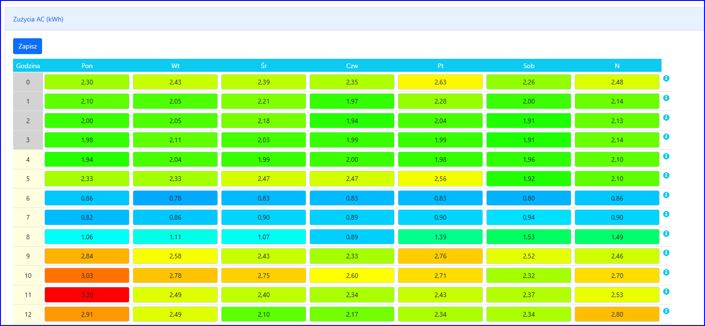

W tym module prognozujesz Zużycie swojego domu.

## Ręczne wprowadzanie Zużycia

Zużycie podzielone jest na godziny i dni tygodnia. Można po
prostu ręcznie wprowadzić kWh dla każdej godziny i dnia tygodnia.

## Import danych z Instalacji

Możesz zaimportować dane z Instalacji. Ustawiasz okres importu,
naciskasz przycisk „Importuj z Instalacji” i program oblicza średnie
obciążenia dla każdej godziny i dnia tygodnia na podstawie
zaimportowanych danych.

## Automatyczny import danych z Instalacji

Jeśli chcesz, aby program co noc importował dane z Instalacji (zawsze
z ostatnich 28 dni) zaznacz opcję „Automatycznie importuj dane w nocy”.

## Import ręczny danych

Możesz skopiować dane z Excela: wstaw godziny w wierszach, a dni
tygodnia w kolumnach. Wybierz dane w programie Excel i wykonaj Kopuj,
wklej dane w polu tekstowym „Twój profil”. Wybierz separator kolumn i
separator dziesiętny, a następnie naciśnij „Importuj”.

Uwagi:

- Jeżeli komórka jest pusta to program nie będzie zmieniał danych w tym miejscu.
- Możesz wkleić mniej niż 24 wiersze lub/i mniej niż 7 kolumn. Program nie zmieni brakujących godzin ani dni tygodnia.
- Możesz wkleić więcej niż 24 wiersze lub/i więcej niż 7 kolumn; Program pominie dodatkowe kolumny i wiersze.

## Wiele profili Zuzycia

Można zdefiniować wiele profili. Wybrany profil jest używany w
„Prognozie baterii” do wyświetlania danych, wykresów i optymalizacji.

## Ograniczenie okresu importowania danych dla profilu

W edycji profilu możesz ustawić „Od miesiąca”, „Od dnia”, aby
ograniczyć dzień rozpoczęcia importu danych z VRM. Jeśli standardowy
dzień rozpoczęcia okresu przypada przed miesiącem i dniem konfiguracji,
import zostanie wykonany na podstawie miesiąca i dnia w konfiguracji.

Jest to przydatne w przypadku Profilu na wakacje, gdy import powinien wykorzystywać dane tylko okresu wakacji, a nie przed nimi.

W ten sam sposób możesz ograniczyć dzień zakończenia okresu z VRM, ustawiając „Do miesiąca” i „Do dnia”.

Jeśli pozostawisz pole „Od dnia” puste, program użyje pierwszego dnia miesiąca.

Jeśli pozostawisz pole „Do dnia” puste, program będzie korzystał z ostatniego dnia danego miesiąca.

## Automatyczna zmiana profilu

Aby automatycznie zmieniać Profile należy:

- Zdefiniować co najmniej dwa Profile z nie pustym polem „Od
  miesiąca” (i ewentualnie „Od dnia”) i pustym polem „Do miesiąca”.
- Zaznaczyć opcję „Automatycznie zmieniaj profil na podstawie pól „Od miesiąca/Dnia””

Program będzie zmieniał profil zgodnie z „Od miesiąca/dnia”

Uwagi: To również ograniczy okres importu danych z Instalacji!

## Automatyczna włączanie i wyłącznie profilu wakacyjnego

Dodatkowo możesz zdefiniować Profile wakacyjne, które nie będą miały
pustych pól zarówno „Od miesiąca/dnia” jak i „Do miesiąca/dnia”.
Program włączy ten Profil w dniu rozpoczęcia i powróci do normalnych
Profili dzień po ostatnim dniu Profilu wakacyjnego.

##
