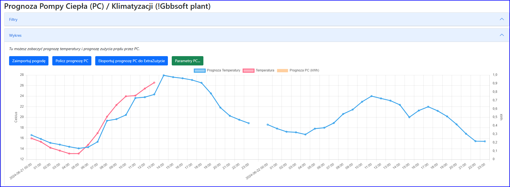
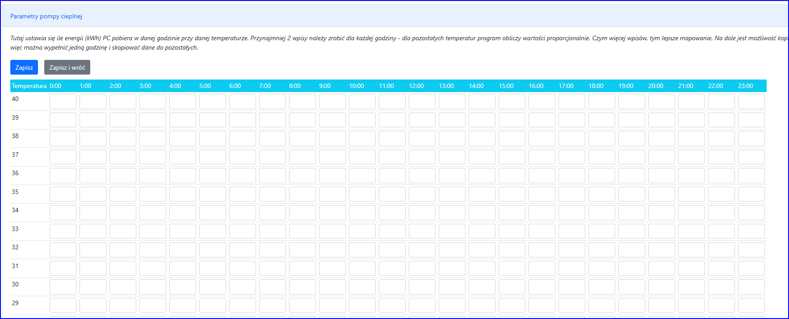

Prognoza PC/Klima pozwala prognozować, ile kWh zużyje Pompa grzewcza lub/i klimatyzacja w zależności od temperatury na zewnątrz.

## Kroki konfiguracji modułu:

1. Wprowadź współrzędne geograficzne Instalacji (szerokość i długość geograficzna) we właściwościach Instalacji
2. Zaimportuj prognozę pogody
3. Naciśnij „Parametry PC” i wprowadź co najmniej 2 zużycie kWh pompy grzewczej / klimatyzacji na każdą godziny
4. Naciśnij „Policz prognozę PC” i sprawdź, czy wszystko jest w porządku
5. Naciśnij "Eksportuj prognozę PC do modułu ExtraZużycie" (menu:
   Profile Zużycia -> przycisk: Extra Zużycia -> Filtr: 'Typ Extra
   Zużycia' = 'Pompa Ciepła')
6. Włącz wszystkie zadania godzinowe: „Importuj prognozę pogody”,
   „Oblicz prognozę Pompy Ciepła”, „Eksportuj prognozę PC do modułu Extra
   Zużycie” -> program co godzinę będzie importował pogodę, obliczał
   prognozę HP i wysyłał do modułu Extra Loads.

## Wstęp

Pompy grzewcze i klimatyzacja (tak jak ładowarki
do pojazdów elektrycznych (EV)) nie działają zgodnie z
rytmem człowieka, zależą od warunków pogodowych: temperatury.
Dlatego lepiej wykluczyć PC (i EV) ze średniej w module
„Profile Zużycia”. Lepiej umieścić PC i EV w module „Extra
Zużycie”.

Moduł ten oblicza kWh zużycia PC/Klimatyzacji na każdą godzinę w
ciągu najbliższych 24h w oparciu o prognozę temperatury i przygotowaną
przez Ciebie tabelę. Najtrudniejszą częścią jest przygotowanie tabeli,
która odwzorowuje temperaturę na zużycie kWh.

## Parametry PC

Tutaj dla każdej godziny należy określić, ile kWh zużywa HP przy danej temperaturze zewnętrznej.

Istnieje kilka opcji, które pomogą Ci wypełnić tę tabelę:

- możesz wypełnić tylko pierwszą kolumnę, a na dole znajduje się
  „Narzędzie kopiowania”, które pozwala kopiować dane z jednej kolumny do
  drugiej, a nawet do wszystkich na raz.
- nie trzeba wpisywać wszystkich temperatur (od -20 do +40). Musisz
  wypełnić co najmniej 2 dowolne temperatury. Program automatycznie
  obliczy kWh dla pozostałych godzin proporcjonalnie (program wyszuka
  2 najbliższe temperatury i skorzysta z proporcji).
- Im więcej danych zostanie wprowadzonych dla danej godziny, tym dokładniejsze będą wyniki.
- Możesz dodać więcej danych póżniej w ciągu roku.

Na przykład: Możesz wpisać tylko godziny, w których masz informację, ile kWh zużywa HP. Np. 10stC i 0stC i -5stC.
