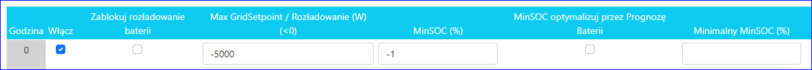
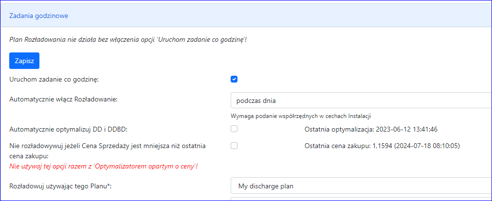
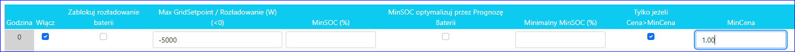
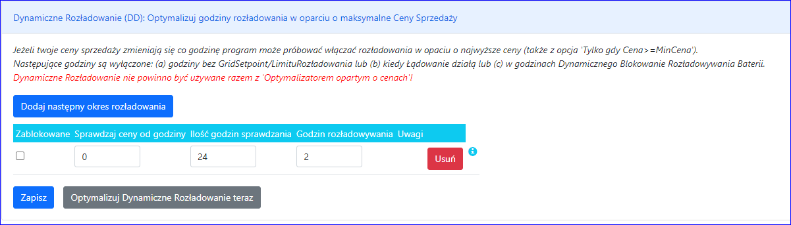
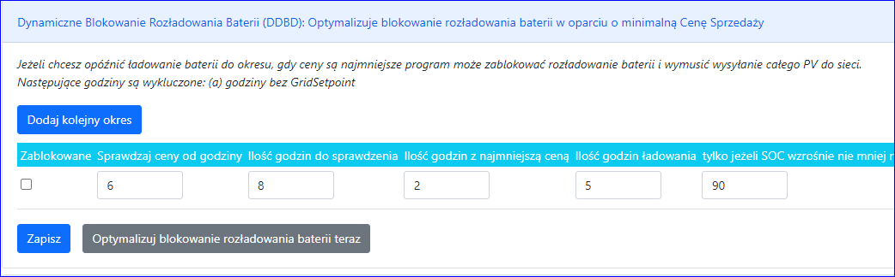
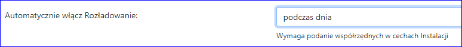

### O ustawienia GridSetpoint w Systemie Victron

GridSetpoint = ile energii powinno trafiać do sieci w „normalnej”
sytuacji (z wyłączeniem momentów, gdy chcesz naładować akumulator lub
momentów, gdy w systemie jest za dużo mocy).

Kiedy ustawisz GridSetpoint na +100W, to w normalnej sytuacji ESS spróbuje pobrać 100W z sieci.
Przykład:
                PV produkuje= 2000W
                Home zużywa= 500W
Zatem pozostaje = 1500W
                Z sieci = 100W
Więc do baterii idzie: 1600W

Ale kiedy ustawisz GridSetpoint = -5000W, wówczas ESS spróbuje wysłać
do sieci 5kW. Najpierw z PV (minus dom), później z akumulatora

Przykład:
                PV produkuje = 2000W
                Home zużywa = 500W
Zatem pozostaje = 1500W
                Do sieci  = 5000W
Więc z baterii pobieramy: 3500W

Inny przykład:
                PV produkuje = 6000W
                Home pobiera = 500W
Zatem pozostaje = 5500W
                Do sieci = 5000W
Więc do baterii idzie: 500W

Aby chronić baterię, możesz:
-    Ustaw MinSOC, a bateria zostanie rozładowana do MinSOC
-    Ustaw „Zablokuj rozładowywanie baterii”, wtedy
akumulator nie będzie rozładowywany poniżej aktualnego SOC (ale będzie
można go naładować)

###

### Pierwszy krok

Aby zacząć rozładowywać, powinieneś:
- stworzyć jeden Plan Rozładowania (o ile nie jest już stworzony)
- Victron: jeżeli 'Battery Life' jest włączony w ESS, powinieneś go
wyłączyć. Ustaw na 'Optimized (without BatteryLife)'.

### Normalne rozładowanie

Aby ustawić normalne rozładowanie we wskazanej godzinie należy:

- zaznaczyć 'Włącz'
- wpisac 'Max Gridsetpoint' na wartość ujemną, ile maksymalnie W powinno iść do sieci.
- (ewentualnie) wprowadzić 'MinSOC' jeżeli chcesz ograniczyć rozładowanie do wskazanego poziomu SOC baterii.

Remarks:
- Powinieneś także ustawić 'Zadania godzinowe' (patrz niżej)
- Program sprawdzi aktualny poziom SOC bateri. Jeżeli MinSOC jest wyższy
niż aktualny SOC, to program wyśle aktualny SOC. Zapobiega to ładowaniu
baterii do MinSOC (zamiast rozładowywania).

###

### Testowanie ustawień

Aby przetestować ustawienia dla bieżącej godziny, naciśnij 'Wyślij teraz dane do instalacji'.

### Zadania godzinowe

Aby ustawić automatyczne wysyłanie danych do Instalacji należy:
- Zaznaczyć 'Uruchom zadanie co godzinę'.
- Victron: wprowadź twój aktualny MinSOC (z modułu ESS w Cerbo) do 'Domyślny MinSOC po rozładowaniu'
- Victron: wprowadź twój aktualny GridSetpoint (z ESS) do 'Domyślny GridSetpoint po rozładowaniu'.
i zapisz zmiany

Uwagi:
- Co godzinę program spróbuje wysłać dane do rozładowania, aby tylko dla godzin z zaznaczonym 'Włacz'.
- Po ostaniej godzinie program wyśle dane wpisane do pól 'Domyślne...'
- Jezeli zaznaczysz 'Nie rozładwywuj jeżeli Cena Sprzedaży jest mniejsza
niż ostatnia cena zakupu', program zablokuje rozładowania, jezeli Cena
Sprzedaży jest mniejsza od średniej ceny prądu w magazynie.

###

### Rozładowuj, jezeli cena jest wyższa niż.

Jeżeli chcesz rozładowywać, jeżeli cena sprzedaży jest wyższa niż, powinieneś:

- zaznaczyć 'Włącz' w wybranej godzinie.
- wprowadzić 'Max GridSetpoint' wartośc ujemną W, Ile maksymalnie prądu powinno iść do sieci.
- (ewentualnie) wprowadź 'MinSOC' jeżeli chcesz ograniczyć rozładowanie baterii do wskazanego SOC.
- zaznaczyć 'Tylko jezeli Cena>MinCenaSprzedaży'
- wprowadzić limit w 'MinCenaSprzedazy'.

### Zblokuj rozładowania/ładowanie baterii.

Jeżeli chcesz zablokować ładowanie/rozładowanie baterii poniżej bieżącego SOC, powinieneś:
- zaznaczyć 'Włącz' w wybranej godzinie.
- tylko Victron: wprowadzić 'Max GridSetpoint' wartośc W, Ile maksymalnie prądu powinno iść do/z sieci.
- zaznaczyć 'Zablokuj rozładowanie baterii' (lub 'Zablokuj ładowanie baterii').

Uwagi:
- tylko Victron: Program o wskazanej godzinie ustawi MinSCO (w module
ESS) na bieżącą wartość SOC, co zablokuje rozładowywanie baterii, ale
pozwoli na jej ładowanie.
- tylko Victron: Po tej godzinie (po tych godzinach) program przywróci
MinSCO (w module ESS) do 'Domyślny MinSOC po rozładowaniu'.
- tylko Victron: Jeżeli ustawisz 'Zablokuj rozładowanie baterii' i
ustawisz 'Max GridSetpoint' na dużą wartość ujemną (np: minus całkowite
Wp twojego PV) wtedy cała energia z PV pójdzie do sieci i ładowanie nie
będzie się odbywało. W ten sposób możesz opóźnijć ładowanie
baterii.

### Dynamiczna zmiana godziny rozładowania w oparciu o cenę sprzedaży (Dynamic Discharge - "DD")

*Nie używaj tej funkcji z 'optymalizatorem opartym o ceny'!*

Aby zacząć używać modułu DD, powinieneś:
- dodać przy najmniej jeden okres rozładowania
- wprowadzić od której godziny i ile godzin program powinien szukać największej ceny sprzedaży
- jeżeli wprowadzić 24 godziny to (a) godzina początkowa jest nieistotna
(b) program będzie sprawdzał 24h zaczynając od bieżącej godziny
- jeżeli wprowadzić mniej niż 24 godzin to program zawsze będzie
sprawdzał godziny zaczynając od wskazanej godziny początkowej. Jeżeli
cały okres jest w przeszłości, to program sprawdzi ten okres
dla dnia następnego.
- wprowadzić ile godzin chcesz rozładowywać
Następnie dla wszystkich godzin we wskazanym okresie, powinieneś:
- wprowadzić 'Max GridSetpoint'
Także, jeżeli chcesz, aby program wysyłał dane automatycznie, powinineś:
- zaznaczyć 'Uruchom zadanie co godzinę'
- zaznaczyć 'Automatycznie optymalizuj DD i DDBD'

Aby przetestować naciśnij przycisk 'Optymalizuj Dynamiczne rozładowania teraz'

Program sprawdzi ceny sprzedaży i zaznaczy godziny z maksymalą ceną sprzedaży. Pozostałe godziny we wskazanym okresie zablokuje.
Program przeskoczy godziny, w których:
- nie ma wpisanego 'Max GridSetpoints'
- obowiązuje ładowanie

Remarks:
- If you define two Dynamic Discharge for the same period. Then first
finds hours with maximal prices then second find other maximal prices
(excludes hours found by first) etc.

###

### Dynamiczne zmiana MaxSCO przez Optymalizator

Jeżeli chcesz, aby Optymalizator z Prognozy Baterii dynamicznie zmieniał MaxSCO, powinieneś:
- zaznaczyć 'Włącz' (lub uzywać DD/DDBD do włączania)
- wpisać 'Max GridSetpoint'
- zaznaczyć 'MinSOC optymalizuj przez Prognozę Baterii'.
- (ewentualnie) wprowadź 'MinimalSOC' aby ograniczyć poziom rozładowania baterii przez Optymalizator
- (ewentualnie) zaznaczyć 'Tylko jeżeli Cena>MinCena' i wprowadzić 'MinCena'

Przykład

Program rozładowuje baterie o godzinie 21:00, kiedy cena sprzedaży
jest najwyższa, aby do godziny 16:00 zrobić miejsce na energię z PV.
Ponadto do godziny 16:00 poziom naładowania baterii nigdy nie spada
poniżej minimalnego SOC.

### Dynamiczne blokowanie rozładowania baterii przed minimalną ceną (Dynamically Disable Battery Discharge - "DDBD")

*Nie używaj tej funkcji z 'optymalizatorem opartym o ceny'!*

Ta opcja wymusi wysyłanie do sieci produkcji PV aż do godziny, w
którym cena jest najniższa, do okresu, w którym lepiej jest ładować
baterie z PV niż sprzedawać energię.

Aby rozpocząć korzystanie z funkcji DDBD, należy:
- dodać przynajmniej jeden okres
- wpisać od jakiej godziny i prze ile godzin program ma szukać minimalnej ceny zakupu
- wpisać ile godzin chcesz ładować baterię
Następnie dla wszystkich godzin objętych okresem należy:
- wprowadź 'Max GridSetpoint' (z dużą liczbą ujemną)
Ponadto, jeśli chcesz, aby program automatycznie wysyłał dane do Instalacji, powinieneś:
- zaznacz opcję „Uruchamiaj zadanie co godzinę:”
- zaznacz opcję „Automatycznie optymalizuj DD i DDBD”

Aby przetestować konfigurację, po prostu naciśnij „Optymalizuj blokowanie baterii teraz”

Program przeskanuje ceny sprzedaży i wyłączy
rozładowywanie przed okresem gdy cenach jest najmniejsza (od
„Sprawdź ceny od godziny”).
Program pominie godziny:
- gdzie brakuje GridSetpoints

### Wyłącz DDBD, jeśli baterie nie będzie ładowana później.

Dodatkowo program może sprawdzić, czy po upływie określonego czasu
baterie będą naładowane do wymaganego poziomu. Jeśli nie,
wyłączy jednorazowe DDBD.
Powinieneś:
- wpisać „Ilość godzin ładowania” – liczba godzin, przez które baterie powinieny być ładowane.
- wpisać „tylko jeżeli SOC wzrośnie nie mniej niż podaną ilość %
podczas godzin ładowania” - ten poziom SOC baterii powinien zostać
osiągnięty w dowolnej godzinie w „Godzinach ładowania”. (Ten poziom jest
sprawdzany tylko w godzinach, w których „Koniec baterii %” jest wyższy
niż „Pocz. bateria %' = Akumulator jest naładowany)

Uwagi:
- Jeżeli pozostawisz puste pole 'tylko jeśli SOC wzrośnie...' puste,
optymalizator prognozy baterii nie będzie sprawdzał, czy bateria
zostanie naładowana do wymaganego poziomu.

### Włącz ładowanie tylko w nocy lub tylko w dzień

Program może automatycznie włączyć rozładowanie tylko w dzień lub tylko w nocy.
Opiera się to na godzinach wschodu i zachodu słońca, dlatego musisz
ustawić szerokość i długość geograficzną w parametrach Instalacji.

### Parametry rozładowania

|  |  |  |
| --- | --- | --- |
| Automatycznie włącz Rozładowanie | Wszyscy | Włacz rozładowywanie (kolumna Włacz) tylko podczas nicy lub dnia i wyłacz w pozostałych godzinach |
| Domyślny MinSOC po operacji rozładowania (%) | Victron | MinSOC ustawiany w inwerterze po rozładowaniu (gdy nie ma rozładowania) |
| Domyślny GridSetpoint po operacji rozładowania (W): | Victron | GridSetpoint/MaxSellPower ustawiany w inwerterze po rozładowaniu |
| Staraj się rozciągnąć rozładowywanie do pełnej godziny | Wszyscy | Ustawiaj GridSetpoint/MaxSellPower w taki sposób, aby rozładowywanie trwało całą godzinę. |
| Zawsze wysyłaj do instalacji (zamiast MinSOC z PlanuRozładowania): | Wszyscy | Zawsze wysyłaj stałą wartość MinSOC podczas rozładowywania. Ale nie podczas "Utrzymanie SOC" o ile następna opcja nie jest zaznaczona.  Idea: prędkość rozładowywania jest kontrolowana tylko przez GridSetpoint/MaxSellPower i nie ograniczana przez TargetSOC, więc jest mała szansa na ładowanie z sieci po osiągnięciu TargetSOC |
| Specjalne liczenie gridsetpoint gdy SOC=TargetSOC | Wszyscy | Podczas utrzymywanie stałego SOC ustaw mały GridSetpoint/MaxSellPower (a nie maksymalny) |
| Zrób GridSetpoint większy o prognozowane Zużycie podczas rozciąganie do pełnej godziny | Wszyscy | Ta opcja jest dla systemów z Domem po stronie sieci inwertera. |
| Deye (Solarman): Wyłącz Peak-Shaving podczas rozładowania baterii do sieci: | Deye | W przypadku niektórych firmware podczas peek-shavingu rozładowanie nie działa, dlatego program może wyłączyć peek-shaving podczas rozładowywania. |
| Deye: ustaw MaxCharge=0 podczas rozładowywania: | Deye | Blokuj ładowania, nawet przypadkowe, podczas godziny rozładowywania |
| Jeżeli nie ma co robić | Victron, Deye | Gdy: (a) brak PV, (b) brak ładowania baterii z sieci, (c) brak rozładowania baterii do sieci, (d) (tylko dla 'odłącz') MinSOC<SOC<MaxSOC i (e) brak ładowania EV wtedy odłącz inwerter od sieci lub (Deye) ustaw 'NoBatt'  Idea: Zmniejszenie zużycia prądu przez inwerter |

### Cena sprzedaży mniejsza lub rózna 0

Aby wykonać operacje specjalne, gdy cena sprzedaży<0, możesz:

[Victron]
- Odłącz od sieci: Victron wchodzi w tryb 'Inverter only'
- Wyłącz opcję 'DC-coupled PV - feed in excess': wyłącza opcje invertery podłączone po stronie prądu stałego
- ustaw „GridSetpoint, jeżeli Cena<=0” np.0. To ograniczy wysyłanie prądu do sieci.
- zaznacz opcję „Włącz Relay 1/2”. Można tego użyć do całkowitego
wyłączenia fotowoltaiki za pomocą wyjścia Relay1 i/lub Relay2 Cerbo.
- Załóż, że nie ma PV (zostało wyłączone): program zakłada, że w godzinach ceny sprzedaży <0 PV w ogóle nie działa.

[HomeAssistant/GbbConnect]
- Załóż, że nie ma PV (zostało wyłączone): program zakłada, że w godzinach ceny sprzedaży <0 PV w ogóle nie działa.

[Solarman]
- Deye: Odłącz od sieci: Program zmienia dozwolone minimalne
napięcie na 270 więc Deye myśli, że napięcie jest poza dozwolonym
przedziałem i odłącza się od sieci
- Deye: Wyłącz 'SolarSell' i włącz 'MI export to Grid cutoff':
program wyłacza SolarSell i MI (mikroinwertery) podczas godzine z
ceną<0
- Załóż, że nie ma PV (zostało wyłączone): program zakłada, że w godzinach ceny sprzedaży <0 PV w ogóle nie działa.

[DeyeCloud]
- Deye: Wyłącz 'SolarSell': program wyłacza SolarSell podczas godzine z ceną<0
- Załóż, że nie ma PV (zostało wyłączone): program zakłada, że w godzinach ceny sprzedaży <0 PV w ogóle nie działa.
