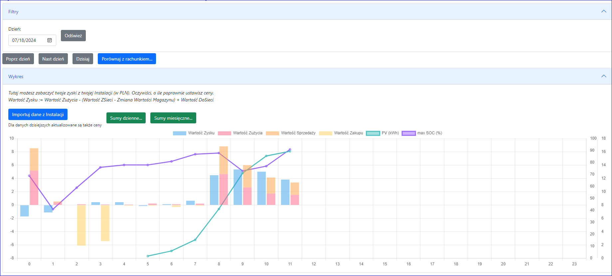

## Zyski

Moduł zbiera dane z Instalacji (ręcznie importuj przynajmniej raz
dziennie lub częściej, albo automatycznie poprzez zaznaczenie opcji
„Automatycznie importuj dane z Instalacji”).

Dane możesz wyświetlać według godzin, dni lub miesięcy. Dane według
godzin są przechowywane przez 2 miesiące, dane według dni są
przechowywane przez 2 lata, a dane według miesięcy są przechowywane na
zawsze w bazie danych.

## Kolumny

Zysk
- "Dzień" - dzień
- "Godzina" - Godzina danego dnia
- "Wartość zysku": Wartość Zużycia- WartośćInwerter - (Wartość
zakupu - Zmiana Wartości baterii) + Wartość Sprzedaży -> Zysk z
Fotowoltaiki w danej godzinie.
- "Zysk / Zużycia" - KPI: Wartość zysku / Zużycie kWh
- "Profit / Solar" - KPI: Wartość zysku / PV kWh
- "Koszt energii": WartośćZakupu - WartośćSprzedaży
- "Z sieci (kWh)" - ile pobrano z sieci w tej godzinie
- "Z sieci zbilansowane (kWh)" - Ile pobrano z sieci po bilansowaniu godzinowym (dla Polski)
- "Cena Zakupu" - cena zakupu energii w tej godzinie
- "Wartość Zakupu": Z sieci [zbilansowane] \* Cena Zakupu + KosztMiesieczny -> wartość zakupionej energii
- "Zakup / Produkcja": KPI: Wartość Zakupu / Wartość Zużycia
- "(Zakup - Sprzedaż) / Produkcja": KPI: (Wartość Zakupu - Wartość
Sprzedaży) / Wartość Zużycia -> ile procent z rachunku za energię
zapłacisz
- "Do sieci (kWh)" - ile wysłano do sieci w tej godzinie
- "Do seici zbilansowane (kWh)" - ile wysłano do sieci po bilansowaniu godzinowym (dla Polski)
- "Cena Sprzedaży" - cena sprzedaży energii w tej godzinie
- "Wartość Sprzedaży": Do sieci [zbilansowane] \* Cena Sprzedaży - Wartość energii wysłanej do sieci
- "Zużycie (kWh)" - zużycie prądu przez dom
- "Cena Zużycia" - Cena po jakiej wyceniany jest prąd zużywany przez dom wliczając to inwerter
- "Wartość Zużycia": Zużycie kWh \* Cena Zużycia
- "Zużycie Inwertera (kWh)" - zużycie prądu przez inwerter
- "Wartość Inwerter": Inwerter Zużycie kWh \* Cena Zużycia
- "Autokonsumpcja" - KPI: 1 - (Dosieci kWh / PV kWh) -> Ile energii z PV nie idzie do sieci w danej godzinie.
- "Samowystarczalność" - KPI: PV / Zużycie -> Ile % energii z PV pokrywa twoje zużycie
- "Round trip efficiente (RTE)" - KPI: DoSieci kWh / (ZSieci kWh + PV kWh - Zuzycie kWh)
- "PV (kWh)" - Ilość energii wyprodukowane przez PV w danej godzinie
- "Do baterii (kWh)" - ilość energii wysłane do baterii (przed zamianą na prąd stały)
- "min SOC (%)" - minimalny SOC baterii w tej godzinie
- "max SOC (%)" - maksymalny SOC baterii w tej godzinie
- "śred SOC (%)" - średni SOC w tej godzinie

Wartość energii w baterii
- "Pocz. SOC (%)" - początkowy SOC w tej godzinie (Jezeli instalacja nie
podaje takiej informacji, to jest ona obliczana na podstawie MinSOC i
MaxSOC)
- "Kon SOC (%)" - końcowy SOC w tej godzinie
- "Zmiana Baterii (kWh)" - >0 ładowanie, <0-rozładowanie
baterii - ile energii poszło do/z baterii (po stronie AC) wyliczone z
różnicy KonSOC-PoczSOC
- "Ładowanie z sieci (kWh)" - ile energii użytej do ładowania baterii pochodzi z sieci (po stronie AC)
- "Ładowanie z PV (kWh)" - ile energii użytej do ładowania baterii pochodzi z PV (po stronie AC)
- "Straty na ładowaiu (kWh)": Zmiana Baterii kWh - (Ładowanie z
sieci kWh + Ładowanie z PV kWh) -> różnica miedzy ilością prądu
podczas ładowania między stronami DC a AC
- "Wydajność ładowania (%)": 1 - Straty na ładowniu kWh
/ (Ładowanie z sieci kWh + Ładowanie z PV) -> Efektywność
ładowania
- "Rozładowanie do sieci (kWh)" - ile energii otrzymanej przy rozładowania baterii idzie do sieci (po stronie AC)
- "Rozładowanie do zużycia (kWh)" - ile energii otrzymanej przy
rozładowania baterii idzie do Zużycia (po stronie AC)
- "Straty na rozładowaiu (kWh)": Zmiana Baterii kWh - (Rozładowanie
do sieci kWh + Rozładowanie do PV kWh) -> różnica miedzy
ilością prądu podczas rozładowania między stronami DC a AC
- "Wydajność rozładowania (%)": 1 - Straty na rozładowniu kWh
/ (Rozładowanie do sieci kWh + Rozładowanie do PV) ->
Efektywność rozładowania
- "Pocz kWh w baterii" - ile energii było w baterii na początku godziny (powyżej MinSOC%)
- "Pocz Wartość (PLN)" - wartośc energii w baterii na początku godziny
- "Kon kWh w baterii": Pocz kWh w baterii + Zmiana baterii kWh -> ile
energii było w baterii na końcu godziny (powyżej MinSOC%)
- "Kon Wartośc (PLN)": Pocz Wartość + Zmiana Wartości baterii -> wartośc energii w bateriach na końcu godziny
- "Zmiana Wartości baterii (PLN)": rozładowywanie: (Rozładowanie do
sieci Wh + Rozładowanie do zużycia Wh) \* Srednia koń cena (dla
poprzedniej godziny); ładowanie: Ładowanie z sieci Wh \* Cena Zakupu
- "Średnia koń cena (PLN)" - Średnia cena energii w baterii na koniec godziny: "Kon Wartość (PLN)" / "Kon kWh w baterii"
- "MinSOC(%)" - zapamiętana wartośc "Minimalna SOC baterii %" z właściwości Instalacji

Wartość Zużycia Extra
- "Cena ExtraZyżycia (PLN)" - średnia cena kWh dla Extra Zużycia,
liczona jako średnia cen: 0 dla PV , Średnia kon cena (PLN) i Cena
Zakupu (w proporcjach użycia)
- "Samochód elektryczny (kWh)" - energia używan na ładowanie EV
- "Samochód elektryczny (PLN)" - wartość energii -> kWh \* Cena ExtraZyżycia
- "Pompa ciepła (kWh)" - Energia zużyta przez Pompe Ciepła
- "Pompa ciepła (PLN)" - wartość energii -> kWh \* Cena ExtraZyżycia
- "Inne1 (kWh)" - Energia zużyta przez Inne1
- "Inne1 (PLN)" - wartość energii -> kWh \* Cena ExtraZyżycia
- "Inne2 (kWh)" - Energia zużyta przez Inne2
- "Inne2 (PLN)" - wartość energii -> kWh \* Cena ExtraZyżycia
