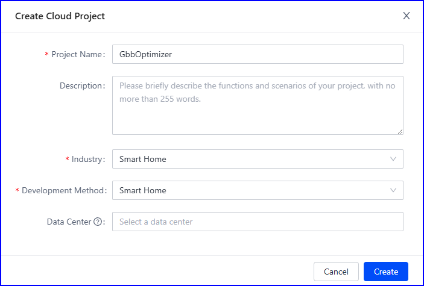
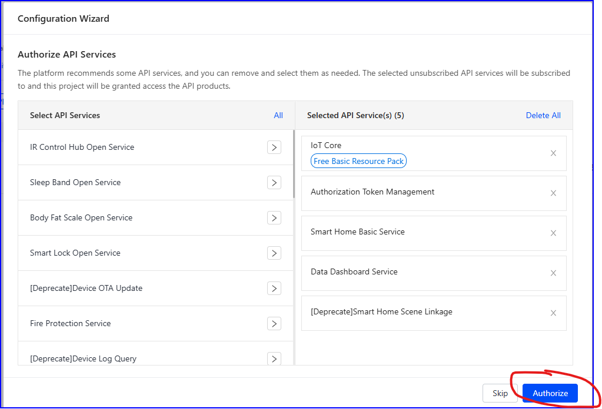
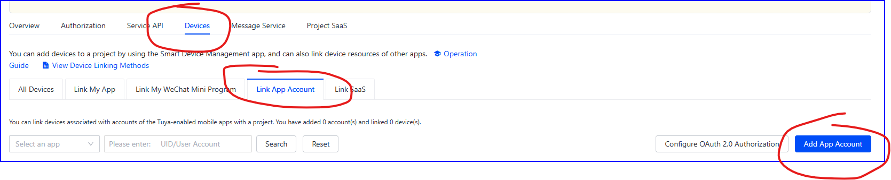
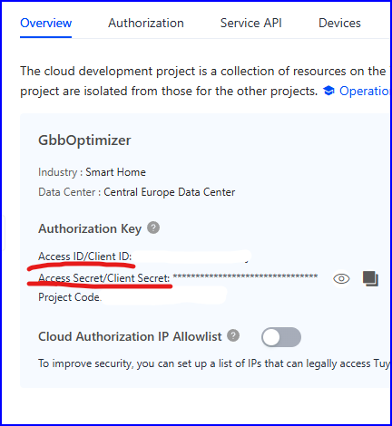

## Tuya: Jak uzyskać Access ID/Client ID i Access Secret/Client Secret?

1. Utwórz konto na <https://platform.tuya.com/>

2. Przejdź do: **Cloud** -> **Development**

3. Po prawej stronie naciśnij przycisk „**Create Cloud Project**”

4. Wypełnij w poniższy sposób... wybierz Data Center najbliższe Twojej lokalizacji

5. Na następnym oknie nacisnij "**Authorize**"

6. Następnie przejdź do: **Devices** -> **Link App Account** i naciśnij "**Add App Account**"

7. Otworzy się okno z kodem QR, który musimy zeskanować w naszej
aplikacji mobilnej. Aby to zrobić w aplikacji mobilnej wybierz
Me w dolnym menu, a następnie ikonę skanowania w prawym górnym rogu.

Konto na platformie zostanie prawidłowo połączone z twoim kontem w
aplikacji Tuya – w zakładce All Devices – mamy listę wszystkich twoich
urządzeń Tuya.

8. W zakładce Overview znajdują się: AccessId/ClientId i AccessSecret/ClientSecret

# Przedłużenie okresu próbnego

1. Zaloguj się na <https://platform.tuya.com/>

2. Idź do: **Cloud** -> **Cloud Services**

3. Wybierz IoTCore i naciśnij "View Details"

4. Naciśnij "Extend Trial Period" i postępuj dalej zgodnie z instrukcjami na ekranie

