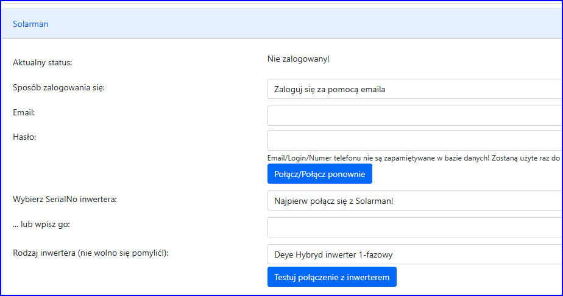
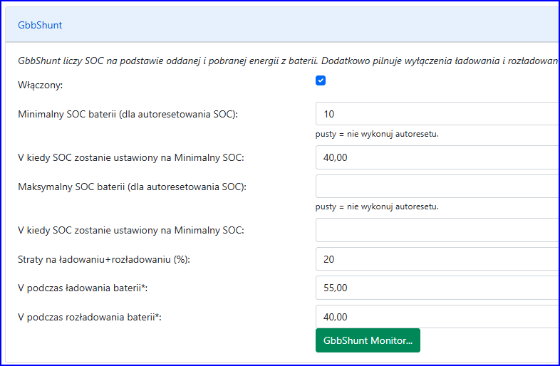
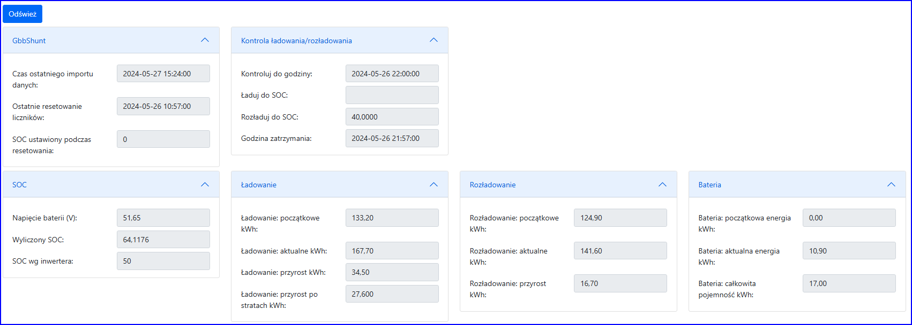

1. Dodaj instalację "Dodaj nową instalację z inwerterem połączonym do Solarman"
2. Wypełnij pola aż do grupy "Solarman"

3. Zaloguj sie do serwerów Solarman: wprowadż email i hasło (to samo co do aplikacji Solarman) i naciśnij "Połącz"
4. Wybierz z listy "Wybierz SerialNo inwertera" swój inwerter
5. Wybierz rodzaj inwertera
6. Naciśnij "Testuj połączenie z inwerterem". Program pobierze aktualny
SOC z inwertera - sprawdź, czy jest poprawny. W module Log znajdziesz
także więcej informacji ze swojego inwertera.
7. Kontynuj wypełnianie pól o bateriach i nacisnij przycisk "Kontynuj w Szybkiej Konfiguracji"

## Sterowanie poprzez napięcie a nie SOC

Jezeli wolisz sterować baterie przez napięcie a nie SOC:

1. Zaznacz 'Steruj poprzez V a nie przez SOC'
2. Nacisnij 'Edytuj mapowanie SOC do V'
3. Wprowadź co najmniej dwa znane pary SOC i V, aby program utworzył
mapowanie.Można wprowadzić więcej znanych par, aby mapowanie było
dokładniejsze.

Uwagi:
- program będzie mapował dowolne wartości SOC na V (i odwrotnie) korzystając z najbliższych (i tylko nabliższych) dwóch punktów.
- mapowanie będzie propocjonalne (liniowe) biorąc pod uwagę dwa najbliższe punkty.

## GbbShunt

GbbShunt został zaprojektowany do sterowania bateriami
kwasowo-ołowiowych. Wykonuje dwie funkcje (normalnie wykonywane przez
inwerter):
- oblicza SOC na podstawie wysłanej i pobranej energii z baterii
- kończy ładowanie i rozładowanie baterii, gdy osiągnięty zostanie wskazany poziom SOC

## Parametry GbbShunt

- Włączony - bez zaznaczenia tego moduł nie działa
- Minimalny SOC baterii (dla autoresetowania SOC) - dolny poziom
SOC, który zostanie automatycznie ustawiony, gdy napięcie spadnie do
poziomu określonego w następnym parametrze
- V kiedy SOC zostanie ustawiony na Minimalny SOC - poziom napięcia
baterii, który powoduje ustawianie 'Minimalny SOC baterii'
- Maksymalny SOC baterii (dla autoresetowania SOC) -
górny poziom SOC, który zostanie automatycznie ustawiony, gdy
napięcie wzrośnie do poziomu określonego w następnym parametrze
- V kiedy SOC zostanie ustawiony na Maksymalny SOC - poziom
napięcia baterii, który powoduje ustawianie 'Maksymalny SOC baterii'
- Straty na ładowaniu+rozładowaniu (%) - procent energi przesłanej do baterii, które są pomijane w obliczeniach
- V podczas ładowania baterii - podczas ładowania program wysyła
ten poziom V do inwertera, a nie V wyliczone z przeliczenia docelowego
SOC
- V podczas rozładowania baterii - podczas rozładowania program
wysyła ten poziom V do inwertera, a nie V wyliczone z przeliczenia
docelowego SOC.

Uwagi:
- oprócz ww. poziomów SOC, program resetuje SOC gdy z wyliczeń wynika, że SOC>100 lub SOC<0.
- GbbShunt jest uruchamiany co minutę. Co minutę poprzez Solarman odczytuje parametry inwertera.
- Dobrze byłoby gdyby inwerter wysyłał do Solarman dane co minutę (a nie jak jest domyślnie co 5 minut).

## GbbShunt Monitor

GbbShunt monitor pokazuje aktualne dane zebrane przez GbbShunt

## Jak GbbShunt oblicza SOC?

1. GbbShunt na podstawie róznicy pomiędzy początkową energią wysłana
do baterii a aktualną oraz różnicą pomiędzy początkową energią pobranej z
baterii a aktualną oblicza ile przybyło energii w baterii od
zapamiętanej początkowej energii.
2. Po podzieleniu aktualnej energii przez całkowitą pojemność baterii program otrzymuje 'Wyliczony SOC'

3. Jeżeli dochodzi do resetu danych (gdy wyliczony SOC<0 lub
SOC>100, lub gdy napięcie baterii dochodzi do poziomów określonych w
parametrach), to program zapamiętuje aktualne wartości jako początkowe
oraz oblicza początkową energię baterii na podstawie 'Wyliczonego SOC'.
4. Przy pierwszy uruchomieniu GbbShunt (albo, gdy dane nie były
importowane dłużej niż przez 12 godzin) program obicza początkową
energię baterii na podstawie SOC pobranego z inwertera.
5. Obliczenia SOC rykonywane są co minutę.

## Jak GbbShunt steruje zakończeniem ładowania lub rozładowania?

1. Przy wysyłce danych (np: TimeOfUse) do inwertera GbbShunt dostaje
informacje o tym, że w bieżącej godzinie trzeba zatrzymać ładowanie lub
rozładowanie gdy bateria osiągnie zadany poziom SOC.
2. Przy ładowaniu: Jeżeli Wyliczony SOC osiągnie zadany poziom SOC lub
więcej to następuje zatrzymanie ładowania. Jeżeli w tej samej godzinie
Wyliczony SOC spadnie poniżej zadanego SOC - 5%, to ładowanie zostanie
wznowione.
3. Przy rozładowaniu: Jeżeli Wyliczony SOC osiągnie zadany poziom SOC
lub mniej to nastepuje zatrzymanie rozładowania. Jeżeli w tej samej
godzinie Wyliczony SOC wzrośnie powyżej zadanego SIC + 5%, to
rozładowanie zostanie wznowione.
4. Zakończenie ładowania/rozładowania powoduje wysłanie do inwertera operacji "Normal"

##
